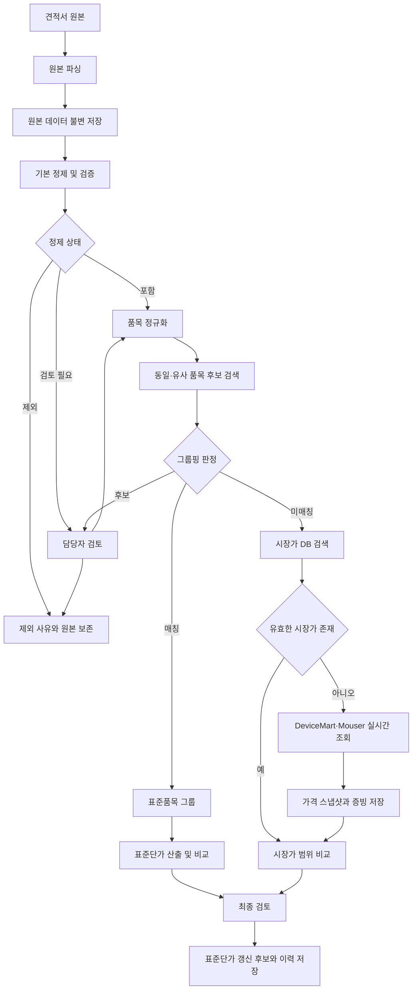

# 데이터 정제·품목 그룹핑·시장가 DB 설계

작성일: 2026-07-25
상태: 사용자 승인 완료, 구현 전 설계

## 1. 목적

회사가 실제로 받은 과거 견적서에서 추출한 데이터를 원본 증빙과 함께 보존하면서, 가격 검토에 사용할 수 있는 내부 표준단가 DB를 만든다. 신규 견적의 품명·규격을 내부 표준품목과 안전하게 매칭하고, 신뢰할 수 있는 내부 매칭이 없을 때만 사전 구축된 외부 시장가 DB와 실시간 조회를 순차적으로 사용한다.

## 2. 확정된 원칙

- `표준단가DB`는 회사가 받은 과거 견적서로 구축한 내부 견적 이력 DB다.
- 외부 판매가격은 `시장가 DB`로 분리하고 표준단가와 혼합하지 않는다.
- 원본 견적 파일, 원본 추출값과 증빙은 삭제하거나 덮어쓰지 않는다.
- 결측·오류·이상치 데이터는 표준단가 산정에서 제외할 수 있지만 원본과 제외 사유를 보존한다.
- 품명과 규격이 유사한 품목을 그룹핑하되, 의미 유사도만으로 자동 병합하지 않는다.
- 내부 DB 매칭이 없거나 신뢰도가 부족할 때만 시장가를 사용한다.
- 시장가는 사전 수집 DB를 우선 조회하고, 없거나 기간이 만료된 경우에만 실시간 조회한다.
- 초기 실행 환경은 로컬 `React + FastAPI + SQLite`이며 사내 서버 설치는 이후 단계다.
- 의미 검색은 사내 hChat 임베딩 API를 연결할 수 있는 어댑터 구조로 만든다.

## 3. 범위

### 포함

- 견적서 원본과 파싱 결과의 불변 보관
- 정제 상태와 제외·검토 사유 관리
- 품명·규격·단위 정규화
- 동일·유사 품목 그룹핑
- 표준단가 재산출과 버전 이력
- DeviceMart와 Mouser 시장가 수집
- 시장가 캐시 우선 조회와 실시간 fallback
- 원본 파일·URL·이미지·응답 데이터 증빙 보존
- 정제·그룹핑·가격 적용에 대한 담당자 검토

### 제외

- 사내 서버 배포
- ERP·구매시스템 연계
- 사용자별 권한과 조직 인증
- 시장가를 이용한 자동 구매 또는 주문
- AI가 검토 없이 표준품목을 자동 병합하는 기능
- AI가 근거 없이 적정 가격을 생성하는 기능

## 4. 전체 흐름

## 5. 데이터 계층

### 5.1 원본 계층

`source_document`

- 원본 파일 경로와 파일명
- 파일 해시
- 파일 형식
- DRM/IRM·파싱 상태
- 공급업체와 견적일
- 최초 등록 시각

`raw_quote_item`

- 원본 문서 ID
- 원본 시트명·행·셀 또는 PDF 페이지
- 원래 품명·규격·단위·수량·단가·금액·메이커
- 파서 이름과 버전
- 파싱 시각과 파싱 경고

원본 계층은 수정하지 않는다. 정제 규칙이 변경돼도 이 계층에서 다시 계산한다.

### 5.2 정제 계층

`clean_quote_item`

- 원본 행 ID
- 정규화된 품명·규격·단위·메이커
- 검증 상태: `INCLUDED`, `EXCLUDED`, `REVIEW_REQUIRED`
- 사유 코드와 설명
- 적용된 정제 규칙 버전
- 검토자와 검토 시각

주요 사유 코드:

- `MISSING_ITEM_NAME`
- `INVALID_UNIT_PRICE`
- `SUMMARY_OR_FEE_LINE`
- `AMOUNT_MISMATCH`
- `COLUMN_SHIFT_SUSPECTED`
- `PRICE_OUTLIER_SUSPECTED`
- `MANUAL_EXCLUSION`

### 5.3 표준품목 계층

`canonical_item`

- 표준품목 ID
- 대표 품명·규격·단위·분류
- 대표 메이커 또는 메이커 조건
- 생성·수정 이력

`item_alias`

- 표준품목 ID
- 원본 또는 정규화 별칭
- 별칭 유형
- 승인자와 승인 시각

`grouping_candidate`

- 원본 정제 행과 후보 표준품목
- 완전일치·퍼지·임베딩 점수
- 단위·규격·분류 호환 결과
- `MATCHED`, `CANDIDATE`, `NO_MATCH` 판정
- 검토 결과와 이력

### 5.4 가격 계층

`price_observation`

- 표준품목 ID
- 정제된 원본 행 ID
- 단가와 수량·단위
- 견적일과 공급업체
- 표준단가 산정 포함 여부

`standard_price_version`

- 표준품목 ID
- 최저·중앙·평균·최고 단가
- 포함 데이터 건수
- 산정 규칙 버전
- 유효 시작 시각
- 이전 버전과 변경 사유

### 5.5 시장가 계층

`market_product`

- 출처: `DEVICEMART` 또는 `MOUSER`
- 출처 상품 ID와 제조사 부품번호
- 품명·규격·제조사·카테고리
- 상품 URL과 이미지 URL

`market_price_snapshot`

- 시장 상품 ID
- 가격과 통화
- 가격 구간의 최소 수량
- 재고와 최소 주문수량
- 부가세·배송비 포함 여부
- 수집 시각과 유효 만료 시각

`market_evidence`

- 시장 가격 스냅샷 ID
- API 원본 응답 또는 HTML 원본
- 페이지 이미지
- 수집기와 버전
- 오류·경고 정보

## 6. 데이터 정제 규칙

### 6.1 자동 제외

- 품명이 공란이거나 공백뿐인 행
- 단가가 공란·0·음수인 행
- 합계·소계·이윤·일반관리비처럼 품목이 아닌 집계·비용 행

비용 행은 원본에서는 보존하고, 품목 단가 산정에서는 제외한다. 향후 비용 분석이 필요하면 별도 비용 항목으로 분류할 수 있다.

### 6.2 검토 필요

- 수량×단가와 금액이 일치하지 않는 행
- 품명·규격·단위 열 밀림이 의심되는 행
- 단위가 품목명처럼 보이거나 품명이 수치로만 구성된 행
- 동일한 비교 그룹 안에서 가격 편차가 큰 행

### 6.3 가격 이상치

- 규격과 단위가 호환되는 동일 표준품목 안에서만 비교한다.
- 데이터가 3건 미만이면 통계적으로 자동 제외하지 않는다.
- 데이터가 3건 이상이면 중앙값 기반 MAD 또는 IQR로 이상치 후보를 만든다.
- 통계상 이상치는 즉시 삭제하지 않고 `REVIEW_REQUIRED`로 보낸다.
- 담당자가 원본과 사양을 확인한 후 `INCLUDED` 또는 `EXCLUDED`로 확정한다.
- 모든 상태 변경은 정제 규칙 버전과 함께 기록한다.

## 7. 품목 정규화와 그룹핑

### 7.1 정규화

- 앞뒤·중복 공백 제거
- 영문 대소문자 통일
- 괄호와 구분 기호 통일
- 단위와 수량 표현 통일
- 품명과 규격에서 모델명·전압·출력·치수 등 핵심 토큰 분리
- 승인된 품목 별칭과 단위 별칭 적용

### 7.2 하이브리드 후보 검색

검색 순서:

1. 정규화 완전일치
2. 키워드·문자열 퍼지 검색
3. hChat 임베딩 의미 검색
4. 단위·규격·분류 호환성 검증

단순 공백·대소문자·승인 별칭 차이는 자동 매칭할 수 있다. 임베딩으로만 유사한 품목은 초기에는 모두 `CANDIDATE`로 보내고 담당자 승인 없이 자동 병합하지 않는다.

### 7.3 미매칭 표현

검색 함수는 무조건 Top-N을 표준품목으로 반환하지 않는다.

- `MATCHED`: 확정 표준품목 사용
- `CANDIDATE`: 후보 목록과 점수 표시, 가격 자동 적용 금지
- `NO_MATCH`: 내부 표준단가 없음, 시장가 조회로 이동

### 7.4 임베딩 인덱스 안전 조건

인덱스 메타데이터에 다음을 저장한다.

- 모델명과 벡터 차원
- 생성 시각
- 표준품목 데이터 해시와 건수
- 정제·그룹핑 규칙 버전

로드 시 품목 수·차원·모델·원본 해시가 다르면 검색을 중단하고 재생성을 요구한다. NumPy 배열을 Python 리스트로 변환하지 않고 정규화된 행렬 곱으로 검색한다.

## 8. 표준단가 산출과 갱신

- `INCLUDED` 상태의 가격 관측값만 사용한다.
- 데이터가 1건이어도 현재 정책상 표준단가로 제공한다.
- 화면에는 데이터 건수, 공급업체 수, 최근 견적일과 가격 범위를 함께 표시한다.
- 평균만 제공하지 않고 최저·중앙·평균·최고를 함께 저장한다.
- 신규 검토 결과는 담당자 승인 후 새 버전을 생성한다.
- 이전 표준단가 버전은 삭제하지 않는다.
- 변경 화면에서 이전 값, 새 값, 반영된 견적과 제외 데이터를 확인할 수 있어야 한다.

## 9. 시장가 캐시 우선 조회

조회 순서:

1. 내부 표준품목의 `MATCHED` 여부 확인
2. 내부 근거가 없거나 사용자가 시장가 비교를 요청하면 시장가 DB 검색
3. 유효한 스냅샷이 있으면 DB 값을 반환
4. 값이 없거나 기간이 만료됐으면 출처 어댑터 실시간 호출
5. 성공한 결과와 증빙을 시장가 DB에 저장
6. 실패하면 오래된 값은 `기간 만료`로만 표시하고 새 가격처럼 사용하지 않음

기본 유효기간은 7일이며 출처와 품목 분류별로 변경할 수 있다. 가격이 자주 변하는 품목은 더 짧은 기간을 적용할 수 있다.

## 10. 시장가 출처 어댑터

### 10.1 Mouser

공식 Search API를 우선 사용한다.

- 키워드와 제조사 부품번호 검색
- 가격 구간, 재고, 최소 주문수량, 제조사, 상품·이미지 URL 저장
- 호출 한도는 설정값으로 관리하고 하드코딩하지 않음
- 환경변수 `MOUSER_API_KEY` 사용
- API 응답 JSON을 증빙으로 보존
- API 정보: <https://www.mouser.com/en/apihome/>
- API 문서: <https://api.mouser.com/api/docs/ui/index?urls.primaryName=api%2Fdocs%2FV2>

### 10.2 DeviceMart

공개 검색과 상품 상세페이지 기반 어댑터로 시작한다.

- 품명·모델명·가격·재고·상품 URL 수집
- 초기에는 수동 일괄 실행
- 구현 전에 자동 접근 허용 범위와 사이트 이용조건 확인
- 자동 접근이 제한되면 CSV·Excel 반입으로 대체
- HTML 원본과 페이지 이미지 저장
- HTML 구조가 바뀌면 기존 DB는 유지하고 수집기만 오류 상태로 전환
- 사이트: <https://www.devicemart.co.kr/main/index>

### 10.3 가격 비교 조건

- 판매처별 가격을 원본 그대로 보존한다.
- 동일 제조사 부품번호와 호환 규격을 우선 매칭한다.
- 수량별 가격 구간을 별도 저장하고 신규 견적 수량에 맞는 구간을 선택한다.
- 통화, 부가세, 배송비와 최소 주문수량 조건이 다른 가격은 그대로 합산·평균하지 않는다.
- 비교 가능한 조건만 이용해 최저·중앙·최고와 판매처 수를 표시한다.

## 11. 오류 처리와 복구

- 원본 파싱 실패: 문서 상태와 오류를 기록하고 원본 보존
- 정제 규칙 실패: 해당 행만 `REVIEW_REQUIRED`, 전체 작업은 계속
- 임베딩 API 실패: 키워드·퍼지 검색으로 fallback하고 의미 검색 불가 표시
- 임베딩 인덱스 불일치: 검색 중단 후 재생성 요구
- 시장가 DB 만료: 기간 만료 표시 후 실시간 조회 시도
- 실시간 시장가 실패: 이전 값은 참고자료로만 표시하고 실패 원인 기록
- HTML 구조 변경: 해당 어댑터만 중단하고 다른 출처와 내부 DB는 정상 동작
- 담당자 오판: 모든 상태·그룹핑·표준단가 변경을 이전 버전으로 되돌릴 수 있음

## 12. 로컬 구성

- 프론트엔드: React
- 백엔드: FastAPI
- 로컬 DB: SQLite
- 원본·이미지 저장: 로컬 파일 시스템
- 임베딩: hChat API 어댑터
- 벡터 검색: NumPy 기반, 향후 데이터 증가 시 별도 인덱스로 교체 가능
- 시장가 수집: 출처별 독립 어댑터

서버 설치 전까지 일괄 크롤링과 인덱스 갱신은 사용자가 로컬에서 명시적으로 실행한다. 백그라운드 상시 스케줄러는 이번 단계에 포함하지 않는다.

구현 시 다음 구성 조건을 함께 충족한다.

- 상대경로는 프로젝트 루트를 기준으로 해석하고 `.env.example`의 견적서 경로는 `QUOTE_FOLDER=견적서`로 제공한다.
- 실행 의존성에는 `openai`, `numpy`, `python-dotenv`를 명시한다.
- 개발·테스트 의존성에는 `pytest`를 명시한다.
- 임베딩 모듈을 독립 파일로만 두지 않고 FastAPI의 실제 품목 검색 서비스에 연결한다.
- 기존 TF-IDF 검색을 제거하지 않고 키워드·퍼지 검색 계층으로 재사용한다.
- 외부 API 테스트는 실제 키가 없어도 실행되도록 클라이언트를 mock 처리한다.

## 13. 기존 데이터 마이그레이션

1. 현재 원본 견적 데이터와 출처 문서를 원본 계층에 등록
2. 원본 파일·시트·행·셀 위치를 가능한 범위에서 연결
3. 정제 규칙을 전체 데이터에 적용
4. 정제 결과에서 표준품목 그룹 후보 생성
5. 담당자 승인 결과로 표준품목과 별칭 생성
6. `INCLUDED` 관측값으로 표준단가 버전 생성
7. 정제된 표준품목을 기준으로 임베딩 인덱스 재생성

현재 사전 생성된 임베딩 인덱스는 정제·그룹핑 버전과 연결되지 않았으므로 마이그레이션 완료 후 다시 생성한다.

## 14. 테스트 전략

### 단위 테스트

- 공란 품명과 잘못된 단가 자동 제외
- 집계·비용 행 분리
- 금액 불일치와 열 밀림 검토 상태
- 정규화 별칭 병합
- 규격·단위 충돌 시 병합 거부
- 이상치 후보 생성과 수동 복구
- 인덱스 품목 수·차원·모델 검증
- 시장가 유효기간 계산
- 수량별 가격 구간 선택

### 통합 테스트

- 견적서 한 건이 원본→정제→그룹핑→표준단가로 이어지는 흐름
- 내부 미매칭 품목이 시장가 DB를 조회하는 흐름
- 시장가 캐시 미스 시 출처 어댑터를 호출하고 증빙을 저장하는 흐름
- 시장가 조회 실패 시 기간 만료 자료만 표시하는 흐름
- 표준단가 갱신 후 이전 버전과 근거가 유지되는지 확인

외부 API와 웹사이트는 실제 호출과 분리해 mock 테스트를 기본으로 하고, 명시적인 통합 테스트에서만 실제 연결을 사용한다.

### 성능 기준

- 2천 건 규모 내부 벡터 검색은 API 호출을 제외하고 100ms 이내
- 견적 품목별 검색이 순차 Python 반복으로 누적되지 않도록 배치·행렬 연산 사용
- 시장가 조회는 캐시 적중 시 외부 호출 없이 완료

## 15. 완료 기준

- 원본과 증빙을 삭제하지 않고 정제 상태를 변경할 수 있다.
- 제외된 데이터의 사유와 원본 위치를 확인할 수 있다.
- 같은 품목의 표현 차이를 그룹핑하고 규격 충돌은 분리한다.
- 유사도만 낮은 품목을 강제로 표준단가와 연결하지 않는다.
- 내부 미매칭 품목만 시장가 흐름으로 이동한다.
- DeviceMart와 Mouser 가격이 출처·수량·조건별로 저장된다.
- 시장가 원본 URL·응답·이미지와 조회 시각을 확인할 수 있다.
- 표준단가 갱신 전후 값과 반영 근거를 조회할 수 있다.
- 로컬 환경에서 서버 설치 없이 전체 흐름을 검증할 수 있다.
